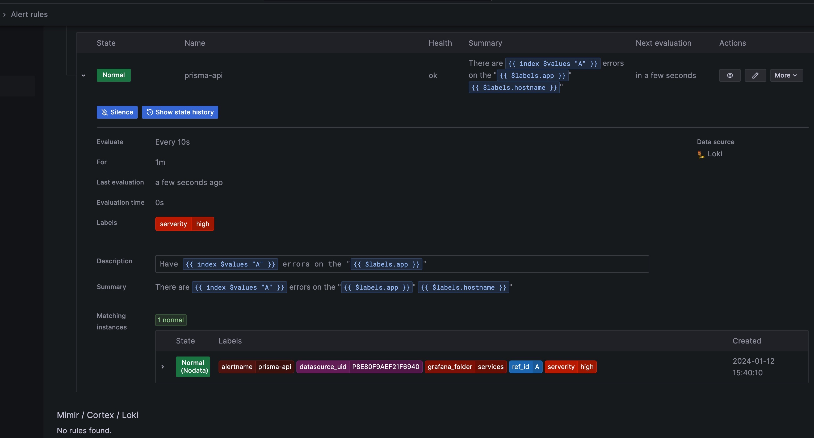
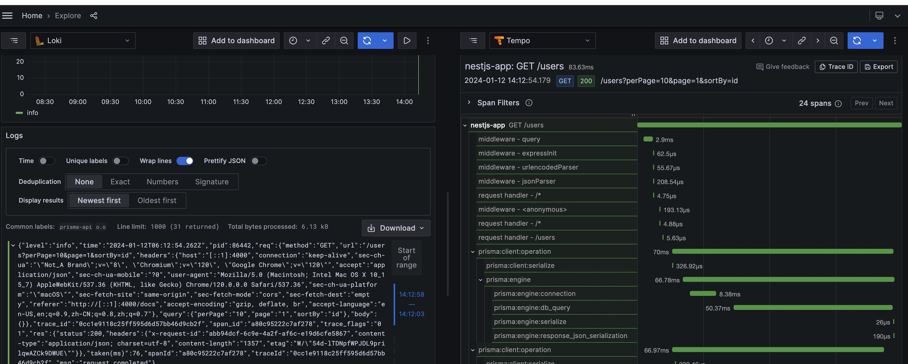

# dockotlp

A monitoring and `Otel` solution

- [Grafana](https://grafana.com/docs/grafana/latest/)
- [Prometheus](https://prometheus.io/)
- [AlertManager](https://grafana.com/docs/grafana/latest/alerting/set-up/migrating-alerts/legacy-alerting/grafana-cloud-alerting/alertmanager/)
- [Loki](https://grafana.com/docs/loki/latest/)
- [Promtail](https://grafana.com/docs/loki/latest/send-data/promtail/)
- [Tempo](https://grafana.com/docs/tempo/latest)

## Install

Clone this repository and run compose up:

```bash
git clone https://github.com/peng-huang-ch/dockotlp.git
cd dockotlp
cp .env.sample .env

vim .env

GF_SECURITY_ADMIN_USER=admin
GF_SECURITY_ADMIN_PASSWORD=changeme
GF_USERS_ALLOW_SIGN_UP=false
GF_SERVER_ROOT_URL=https://grafana.example.com

docker-compose up -d
```

Prerequisites:

- Docker Engine >= 1.13
- Docker Compose >= 1.11

Containers:

- OtelCollector (OpenTelemetry Collector) `http://<host-ip>:4317`
- Prometheus (metrics database) `http://<host-ip>:9090`
- AlertManager (alerts management) `http://<host-ip>:9093`
- Grafana (visualize metrics) `http://<host-ip>:3000`
- Loki `http://<host-ip>:3100`
- Promtail `http://<host-ip>:9080`
- Tempo `http://<host-ip>:3200`

> Please check out the [dockprom](https://github.com/stefanprodan/dockprom) first if you wanna monitor the docker host and services, it would be very helpful this project only focus the `otel` part.

## Setup Grafana

Navigate to `http://<host-ip>:3000` and login with user **_admin_** password **_admin_**. You can change the credentials in the compose file or by supplying the `GF_SECURITY_ADMIN_USER` and `GF_SECURITY_ADMIN_PASSWORD` environment variables on compose up. The config file can be added directly in grafana part like this

```yaml
grafana:
  image: grafana/grafana:10.2.2
  restart: unless-stopped
  environment:
    - GF_SERVER_ROOT_URL=${GF_SERVER_ROOT_URL} # your domain url
    - GF_SECURITY_ADMIN_USER=${GF_SECURITY_ADMIN_USER:-admin}
    - GF_SECURITY_ADMIN_PASSWORD=${GF_SECURITY_ADMIN_PASSWORD:-changepass}
    - GF_USERS_ALLOW_SIGN_UP=${GF_USERS_ALLOW_SIGN_UP:-false}
```

and the config file format should have this content

```yaml
GF_SECURITY_ADMIN_USER=admin
GF_SECURITY_ADMIN_PASSWORD=changeme
GF_USERS_ALLOW_SIGN_UP=false
```

If you want to change the password, you have to remove this entry, otherwise the change will not take effect

```yaml
- ./data/grafana:/var/lib/grafana
```

Grafana is pre configured with dashboards and Prometheus as the default data source:

- Name: Prometheus
- Type: Prometheus
- Url: [http://prometheus:9090](http://prometheus:9090)
- Access: proxy

**_Grafana Alerts_**



## Setup Loki



The Grafana Loki is a set of components that can be composed into a fully featured logging stack.

The loki can be configured in [etc/loki.yaml](./etc/loki.yaml) file.
A complete list of integrations can be found [here](https://grafana.com/docs/loki/latest/configure/examples/).

The Tempo can be configured in [etc/tempo.yaml](./etc/tempo.yaml) file.
A complete list of integrations can be found [here](https://grafana.com/docs/tempo/latest/configuration/manifest/).

## Setup alerting

The AlertManager enables you to quickly and efficiently manage and respond to alerts. It receives alerts, handles silencing, inhibition, grouping, and routing by sending notifications out via your channel of choice, for example, email or Slack.
A complete list of integrations can be found [here](https://grafana.com/docs/grafana-cloud/alerting-and-irm/alerting/fundamentals/alertmanager/).

The notification receivers can be configured in [etc/alertmanager.yml](./etc/alertmanager.yaml) file.

To receive alerts via Slack you need to make a custom integration by choose **_incoming web hooks_** in your Slack team app page.
You can find more details on setting up Slack integration [here](http://www.robustperception.io/using-slack-with-the-alertmanager/).

Copy the Slack Webhook URL into the **_api_url_** field and specify a Slack **_channel_**.

```yaml
route:
  receiver: "slack"

receivers:
  - name: "slack"
    slack_configs:
      - send_resolved: true
        text: "{{ .CommonAnnotations.description }}"
        username: "Prometheus"
        channel: "#<channel>"
        api_url: "https://hooks.slack.com/services/<webhook-id>"
```


## Thanks the following projects

- [dockprom](https://github.com/stefanprodan/dockprom)

- [otlp](https://github.com/open-telemetry)
